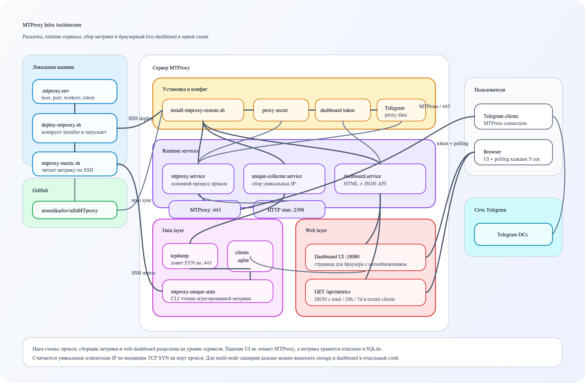

# MTProxy Infra

Воспроизводимая раскатка `Telegram MTProxy` на новый сервер с метрикой уникальных клиентских `IP`, GeoIP-городом, браузерным live-дашбордом, базовым auto-heal watchdog и Telegram-alerting.

<p align="center">
  <a href="docs/architecture.md">
    
  </a>
</p>

Что внутри:

- `scripts/install-mtproxy-remote.sh` — ставит `MTProxy`, `systemd`-юниты, сборщик метрики, GeoIP-кэш, HTTP-дашборд и watchdog
- `scripts/deploy-mtproxy.sh` — локально копирует installer на сервер и запускает его по `SSH`
- `scripts/mtproxy-metric.sh` — локально читает метрику с сервера
- `docs/mtproxy.md` — короткая инструкция
- `docs/architecture.md` — схема архитектуры
- `.mtproxy.env.example` — шаблон локального конфига

Что на сервере появляется после раскатки:

- `mtproxy.service` — основной прокси
- `mtproxy-unique-collector.service` — сбор уникальных IP
- `mtproxy-dashboard.service` — web UI и API
- `mtproxy-watchdog.service` + `mtproxy-watchdog.timer` — периодическая health-проверка и auto-heal
- Telegram-alerts — уведомления о падении и восстановлении через Bot API
- `kernel.pid_max = 65535` — защита от повторения бага `MTProxy` на высоких PID

Быстрый старт:

```bash
cp .mtproxy.env.example .mtproxy.env
make mtproxy-deploy HOST=root@SERVER_IP
make mtproxy-metric
```

Подробности:

- [docs/mtproxy.md](docs/mtproxy.md)
- [docs/architecture.md](docs/architecture.md)
