# MTProxy Architecture

Ниже схема текущей архитектуры `mtproxy-infra`.

## Visual Diagram

```mermaid
%%{init: {'theme': 'base', 'themeVariables': {
  'background': '#ffffff',
  'primaryColor': '#f8fafc',
  'primaryTextColor': '#0f172a',
  'primaryBorderColor': '#cbd5e1',
  'lineColor': '#475569',
  'secondaryColor': '#ecfeff',
  'tertiaryColor': '#f8fafc'
}}}%%
flowchart TB
    subgraph LOCAL["Локальная машина"]
        direction TB
        ENV[".mtproxy.env"]
        DEPLOY["scripts/deploy-mtproxy.sh"]
        CLI["scripts/mtproxy-metric.sh"]
        ENV --> DEPLOY
    end

    subgraph GIT["GitHub"]
        direction TB
        REPO["alfaMTproxy repo"]
    end

    subgraph SERVER["Сервер MTProxy"]
        direction TB

        subgraph INSTALLATION["Установка и конфиг"]
            direction LR
            INSTALL["install-mtproxy-remote.sh"]
            SECRET["/etc/mtproxy/secret"]
            TOKEN["/etc/mtproxy/dashboard-token"]
            TGCONF["/opt/mtproxy-data/*"]
            SYSCTL["/etc/sysctl.d/60-mtproxy-reliability.conf"]
            INSTALL --> SECRET
            INSTALL --> TOKEN
            INSTALL --> TGCONF
            INSTALL --> SYSCTL
        end

        subgraph RUNTIME["Runtime services"]
            direction LR
            MTSVC["mtproxy.service"]
            COLSVC["mtproxy-unique-collector.service"]
            DASHSVC["mtproxy-dashboard.service"]
            WATCHDOG["mtproxy-watchdog.timer"]
        end

        subgraph DATA["Data layer"]
            direction TB
            TCPDUMP["tcpdump SYN capture"]
            DB[("clients.sqlite")]
            STATS["mtproxy-unique-stats"]
            TCPDUMP --> DB
            STATS --> DB
        end

        subgraph HTTP["Web layer"]
            direction TB
            API["/api/metrics :18080"]
            UI["Dashboard UI :18080"]
        end

        PROXY["MTProxy :443"]
        LOCALSTATS["HTTP stats :2398 localhost"]

        INSTALL --> MTSVC
        INSTALL --> COLSVC
        INSTALL --> DASHSVC
        INSTALL --> WATCHDOG
        SECRET --> MTSVC
        TGCONF --> MTSVC
        TOKEN --> DASHSVC

        MTSVC --> PROXY
        MTSVC --> LOCALSTATS

        COLSVC --> TCPDUMP
        DASHSVC --> DB
        DASHSVC --> API
        DASHSVC --> UI
        WATCHDOG --> MTSVC
        WATCHDOG --> COLSVC
        WATCHDOG --> DASHSVC
    end

    subgraph USERS["Пользователи"]
        direction TB
        TGCLIENT["Telegram clients"]
        BROWSER["Browser"]
    end

    subgraph TELEGRAM["Сеть Telegram"]
        direction TB
        TGDC["Telegram DCs"]
    end

    REPO --> DEPLOY
    DEPLOY -->|SSH + installer| INSTALL
    CLI -->|SSH: mtproxy-unique-stats| STATS

    TGCLIENT -->|MTProto / 443| PROXY
    PROXY --> TGDC

    BROWSER -->|token + UI| UI
    BROWSER -->|polling 5s| API

    classDef local fill:#e0f2fe,stroke:#0284c7,stroke-width:2px,color:#082f49;
    classDef git fill:#dcfce7,stroke:#16a34a,stroke-width:2px,color:#052e16;
    classDef install fill:#fef3c7,stroke:#d97706,stroke-width:2px,color:#451a03;
    classDef runtime fill:#ede9fe,stroke:#7c3aed,stroke-width:2px,color:#2e1065;
    classDef data fill:#fae8ff,stroke:#c026d3,stroke-width:2px,color:#4a044e;
    classDef web fill:#fee2e2,stroke:#dc2626,stroke-width:2px,color:#450a0a;
    classDef user fill:#f1f5f9,stroke:#475569,stroke-width:2px,color:#0f172a;
    classDef telegram fill:#cffafe,stroke:#0891b2,stroke-width:2px,color:#083344;

    class ENV,DEPLOY,CLI local;
    class REPO git;
    class INSTALL,SECRET,TOKEN,TGCONF,SYSCTL install;
    class MTSVC,COLSVC,DASHSVC,WATCHDOG,PROXY,LOCALSTATS runtime;
    class TCPDUMP,DB,STATS data;
    class API,UI web;
    class TGCLIENT,BROWSER user;
    class TGDC telegram;
```

## Runtime Flow

1. Оператор запускает `scripts/deploy-mtproxy.sh` с локальной машины.
2. Скрипт по `SSH` копирует и запускает `scripts/install-mtproxy-remote.sh` на целевом сервере.
3. Installer ставит `MTProxy`, создает `systemd`-сервисы и сохраняет:
   - `secret` прокси
   - `dashboard token`
   - `sysctl`-защиту для `pid_max`
4. `mtproxy.service` поднимает `MTProxy` на внешнем порту `443`.
5. Telegram-клиенты подключаются к `MTProxy`, а тот проксирует трафик в `Telegram DCs`.
6. `mtproxy-unique-collector.service` через `tcpdump` ловит входящие `TCP SYN` на порт прокси и пишет уникальные IP в `SQLite`.
7. `mtproxy-dashboard.service` читает `SQLite`, отдает HTML-дашборд и API `/api/metrics`.
8. `mtproxy-watchdog.timer` раз в минуту проверяет `mtproxy`, `collector`, `dashboard`, порты и health endpoints, а при сбое делает auto-heal через `systemctl restart`.
9. Браузер опрашивает API каждые `5` секунд и обновляет экран.
10. Локальный `scripts/mtproxy-metric.sh` при необходимости читает ту же метрику через `SSH`.

## Main Components

| Компонент | Назначение |
|---|---|
| `scripts/deploy-mtproxy.sh` | удалённая раскатка на новый сервер |
| `scripts/install-mtproxy-remote.sh` | установка сервисов и конфигурации на сервере |
| `mtproxy.service` | основной `MTProxy` процесс |
| `mtproxy-unique-collector.service` | сбор уникальных IP из сетевого трафика |
| `mtproxy-dashboard.service` | HTTP UI и JSON API |
| `mtproxy-watchdog.timer` | периодическая health-проверка и auto-heal |
| `clients.sqlite` | хранилище агрегированной метрики |
| `mtproxy-unique-stats` | CLI для чтения метрики на сервере |

## Data Stores

| Хранилище | Что лежит |
|---|---|
| `/etc/mtproxy/secret` | `MTProto secret` для Telegram proxy |
| `/etc/mtproxy/dashboard-token` | токен доступа к веб-дашборду |
| `/etc/sysctl.d/60-mtproxy-reliability.conf` | `pid_max` защита для стабильного старта `MTProxy` |
| `/var/lib/mtproxy-metrics/clients.sqlite` | уникальные IP, `first_seen`, `last_seen`, `hits` |
| `/opt/mtproxy-data/proxy-secret` | официальный Telegram proxy secret blob |
| `/opt/mtproxy-data/proxy-multi.conf` | конфиг Telegram DC для MTProxy |

## Ports

| Порт | Кто слушает | Для чего |
|---|---|---|
| `443/tcp` | `MTProxy` | входящие Telegram-подключения |
| `2398/tcp` | `MTProxy` на `localhost` | внутренние HTTP stats |
| `18080/tcp` | `mtproxy-dashboard` | веб-дашборд и API |
| `22/tcp` | `sshd` | деплой и CLI-доступ |

## Boundaries

- `MTProxy` и дашборд логически разделены: падение UI не ломает прокси.
- Метрика основана на `IP`, а не на Telegram user id.
- Токен дашборда отделен от `MTProto secret`.
- `SQLite` достаточно для одной ноды; при нескольких прокси нужен общий backend или сбор в отдельный storage.

## Scaling Notes

- Сейчас архитектура оптимальна для одной ноды `MTProxy`.
- Для горизонтального масштабирования обычно добавляют:
  - несколько MTProxy-инстансов
  - внешний балансировщик
  - централизованный storage метрик
  - отдельный web/API слой для общей панели
